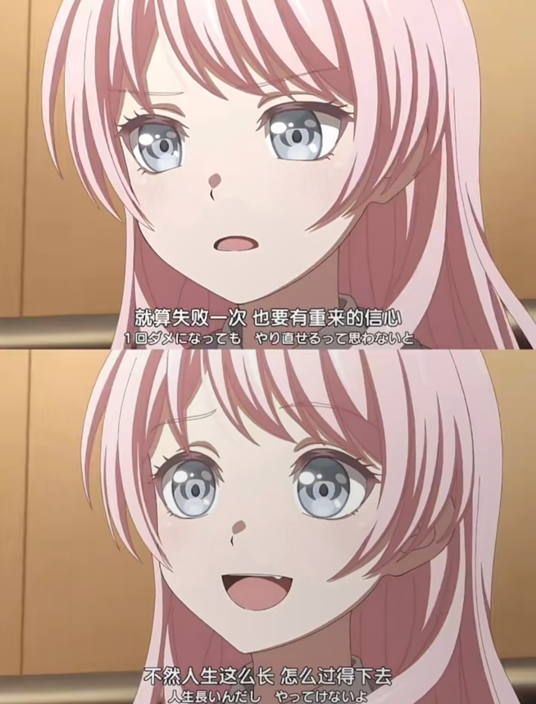

# Welcome to my code world(｡･ω･｡)

<table>
<tr>
<td width="60%" style="vertical-align: top;">
  
<em>"AI can help you understand open source code - this is the greatest learning opportunity in history."</em>

  
  
<em>"Open source, this way of sharing with the world, is full of anticipation and goodwill. We learn and grow in open source, we respond to this expectation and live up to this goodwill. This is the luckiest thing in the world."</em>

</td>
<td width="40%" style="text-align: right; vertical-align: top;">
  
</td>
</tr>
</table>

*Keep learning, keep growing.* 
